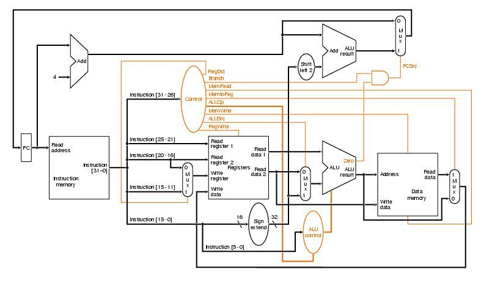

HITwh NSCSCC Team | 哈尔滨工业大学（威海）全国大学生计算机系统能力培养大赛小组

[TOC]

# 2-浅析计组课设中制作的CPU

大家是否还记得这一张图：

这是一个典型的单周期MIPS CPU架构：

1. PC生成下一个指令的地址；
2. 译码模块译码，CU通过译码模块翻译出来的操作码控制寄存器堆（Register File）的相应读写；
3. CU将控制信号传给ALU控制器，然后ALU控制器控制ALU进行相应的运算；
4. 最后ALU的结果需要写回给寄存器堆或者内存，CU仍然需要发出控制信号控制RegFile等器件的行为；
5. 当然，这幅图与我们当时设计的CPU还是**有所区别**的，这个之后会说明。

## 单周期处理器设计步骤

1. 分析指令系统，得出数据通路；
2. 为数据通路选择合适的器件；
3. 连接组件建立数据通路；
4. 分析每条指令的实现，确定控制信号；
5. 集成控制信号，形成完整的控制逻辑。

## 到底有什么区别呢？

细心的你可能会发现，单周期处理器在每个周期就会送出一个结果或者完成一条指令。但你曾经是否记得当时：

1. 我们采用状态机完成CPU；
2. 完成指令不止一个时间周期；
3. 图里面多了很多寄存器。

当然可能还有很多不同，但主要是这三方面。

那这有啥区别呢？

1. 由于有寄存器，每一个上升沿（或下降沿）会进行一次数据锁存；
2. 通过状态机和控制器，控制整个处理过程的状态，每个周期只做一个过程（比如取值或者译码过程）；
3. 其实我们把它称作为**多周期处理器**。

当然，多周期处理器是流水处理器的**前提**条件和**基础**。