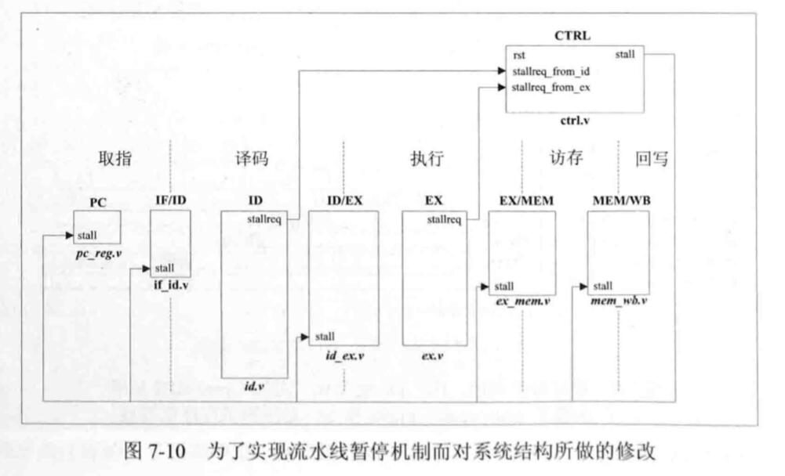

HITwh NSCSCC Team | 哈尔滨工业大学（威海）全国大学生计算机系统能力培养大赛小组

[TOC]

# 9-2-ORI 指令数据相关的解决办法 2 - 流水线暂停

## 注意事项

流水线暂停位于opm的第七章，里面已经实现了很多东西，所以这篇文档的代码和之前的不兼容，于是只截取重点部分给大家讲解。

不过因为大家学习本文档的初衷是理解五级流水如何实现，所以代码并不重要，重要的是理解思维。

## 简介


前面说过，视觉上来说，流水线暂停其实是在检测到流水线相关问题时，在流水线中插入一些暂停周期，等待前面的指令完全执行完毕后再恢复流水线。

对于相邻两条ORI产生数据相关时：

- 前一条指令在WB阶段的最后一个时钟周期把数据写入RegFile
- 后一条指令在ID阶段请求一个正确的值

所以理论上，我们要**插入三个暂停周期，即将第二条指令的ID阶段推迟到第一条指令的WB阶段后**，但是在此之前，我们已经在RegFile里面实现了数据前推：

```verilog
// 当读地址与写地址相同，且写使能，且端口1读使能，则要把写入的数据直接读出来
       //   数据前推的实现，后面会提及
	  end else if((raddr1 == waddr) && (we == `WriteEnable) 
	  	            && (re1 == `ReadEnable)) begin
	  	  rdata1 <= wdata;
       // 否则读取相应寄存器单元
	  end
```

所以我们只需要**插入两个暂停周期，将第二条指令的ID阶段推迟到第一条指令的WB阶段**，其实这是一个“带数据前推的流水线暂停”。

## 实现

一种直观的实现方式是：

- 保持PC的值不变
- 保持流水线各个阶段的寄存器不变

我们采用一个改进的暂停方式：

- 保持PC的值不变
- 保持流水线第n阶段以及之前的各个阶段的寄存器不变
- 第n阶段后面的指令继续运行

比如EX阶段请求暂停，则保持IF/ID/EX阶段的流水线寄存器的值不变，而处于MEM/WB阶段的指令继续执行。

为此我们要新增一个模块，这个模块不属于流水线的任何一个阶段。

### 新增CTRL模块



CTRL模块的输入来自于ID、EX模块的请求暂停信号 stallreq。CTRL模块会对暂停请求信号进行判断，然后输出流水线暂停信号stall。看图可知stall输出到PC、IF/ID、ID/EX、EX/MEM、MEM/WB等模块，从而控制PC值以及各个阶段的流水线寄存器。

### CTRL模块的实现

CTRL模块的接口如图所示：


其中stall信号是一个宽度为6的信号，用每位的数值（0或者1）来给出是否暂停的信号。

代码如下：

```verilog
`include "defines.v"

module ctrl(

	input wire					 rst,

	input wire                   stallreq_from_id, // 来自ID阶段的暂停请求
	input wire                   stallreq_from_ex, // 来自EX阶段的暂停请求
	output reg[5:0]              stall       
	
);


    // 1表示暂停，0表示继续执行
	always @ (*) begin
		if(rst == `RstEnable) begin
			stall <= 6'b000000;
		end else if(stallreq_from_ex == `Stop) begin
			stall <= 6'b001111;
		end else if(stallreq_from_id == `Stop) begin
			stall <= 6'b000111;			
		end else begin
			stall <= 6'b000000;
		end    //if
	end      //always
			

endmodule
```

### 修改IF阶段

PC模块的代码如下：

```verilog
	always @ (posedge clk) begin
		if (ce == `ChipDisable) begin
			pc <= 32'h00000000;
            // 如果IF阶段不需要暂停，则PC值继续增加
		end else if(stall[0] == `NoStop) begin
		  		pc <= pc + 4'h4;
		end
	end
```

修改IF/ID模块：

```verilog
	always @ (posedge clk) begin
		if (rst == `RstEnable) begin
			id_pc <= `ZeroWord;
			id_inst <= `ZeroWord;
            // 当IF阶段暂停且ID阶段继续的时候，用空指令作为下一个周期进入译码阶段的指令
		end else if(stall[1] == `Stop && stall[2] == `NoStop) begin
			id_pc <= `ZeroWord;
			id_inst <= `ZeroWord;	
            // 否则继续执行
	    end else if(stall[1] == `NoStop) begin
		    id_pc <= if_pc;
		    id_inst <= if_inst;
		end
	end
```

### 修改ID阶段

ID模块可以请求流水线暂停，但是由于目前ORI指令不会在ID阶段请求暂停（加载、存储指令才会有这种情况，感兴趣的同学自行学习），所以直接让ID模块发出“不暂停”的信号：

```verilog
assign stallreq = `NoStop;
```

修改ID/EX模块：

```verilog
	always @ (posedge clk) begin
		if (rst == `RstEnable) begin
			ex_aluop <= `EXE_NOP_OP;
			ex_alusel <= `EXE_RES_NOP;
			ex_reg1 <= `ZeroWord;
			ex_reg2 <= `ZeroWord;
			ex_wd <= `NOPRegAddr;
			ex_wreg <= `WriteDisable;
            // 如果ID阶段暂停而且EX阶段继续执行，则给EX阶段传递空操作
		end else if(stall[2] == `Stop && stall[3] == `NoStop) begin
			ex_aluop <= `EXE_NOP_OP;
			ex_alusel <= `EXE_RES_NOP;
			ex_reg1 <= `ZeroWord;
			ex_reg2 <= `ZeroWord;
			ex_wd <= `NOPRegAddr;
			ex_wreg <= `WriteDisable;
            // 否则继续执行
		end else if(stall[2] == `NoStop) begin		
			ex_aluop <= id_aluop;
			ex_alusel <= id_alusel;
			ex_reg1 <= id_reg1;
			ex_reg2 <= id_reg2;
			ex_wd <= id_wd;
			ex_wreg <= id_wreg;		
		end
	end
```

### 修改EX阶段

EX模块可以请求暂停，但是由于目前ORI指令不会在EX阶段请求暂停（感兴趣的同学自行学习），所以忽略EX模块的修改。

修改EX/MEM模块：

```verilog
	always @ (posedge clk) begin
		if(rst == `RstEnable) begin
			mem_wd <= `NOPRegAddr;
			mem_wreg <= `WriteDisable;
		  mem_wdata <= `ZeroWord;	
		  mem_hi <= `ZeroWord;
		  mem_lo <= `ZeroWord;
		  mem_whilo <= `WriteDisable;		
	    hilo_o <= {`ZeroWord, `ZeroWord};
			cnt_o <= 2'b00;	
            // 如果EX阶段暂停而且MEM阶段继续执行，则给MEM阶段传递空操作
		end else if(stall[3] == `Stop && stall[4] == `NoStop) begin
			mem_wd <= `NOPRegAddr;
			mem_wreg <= `WriteDisable;
		  mem_wdata <= `ZeroWord;
		  mem_hi <= `ZeroWord;
		  mem_lo <= `ZeroWord;
		  mem_whilo <= `WriteDisable;
	    hilo_o <= hilo_i;
			cnt_o <= cnt_i;
            // 否则继续执行
		end else if(stall[3] == `NoStop) begin
			mem_wd <= ex_wd;
			mem_wreg <= ex_wreg;
			mem_wdata <= ex_wdata;	
			mem_hi <= ex_hi;
			mem_lo <= ex_lo;
			mem_whilo <= ex_whilo;	
	    hilo_o <= {`ZeroWord, `ZeroWord};
			cnt_o <= 2'b00;	
		end else begin
	    hilo_o <= hilo_i;
			cnt_o <= cnt_i;											
		end    //if
	end      //always
			

endmodule
```

### 修改MEM阶段

此阶段只需要修改MEM/WB模块：

```verilog
	always @ (posedge clk) begin
		if(rst == `RstEnable) begin
			wb_wd <= `NOPRegAddr;
			wb_wreg <= `WriteDisable;
		  wb_wdata <= `ZeroWord;	
		  wb_hi <= `ZeroWord;
		  wb_lo <= `ZeroWord;
		  wb_whilo <= `WriteDisable;	
            // 如果MEM阶段暂停而且WB阶段继续执行，则给WB阶段传递空操作
		end else if(stall[4] == `Stop && stall[5] == `NoStop) begin
			wb_wd <= `NOPRegAddr;
			wb_wreg <= `WriteDisable;
		  wb_wdata <= `ZeroWord;
		  wb_hi <= `ZeroWord;
		  wb_lo <= `ZeroWord;
		  wb_whilo <= `WriteDisable;
            // 否则继续执行
		end else if(stall[4] == `NoStop) begin
			wb_wd <= mem_wd;
			wb_wreg <= mem_wreg;
			wb_wdata <= mem_wdata;
			wb_hi <= mem_hi;
			wb_lo <= mem_lo;
			wb_whilo <= mem_whilo;			
		end    //if
	end      //always
```

至此，流水线暂停已经实现！